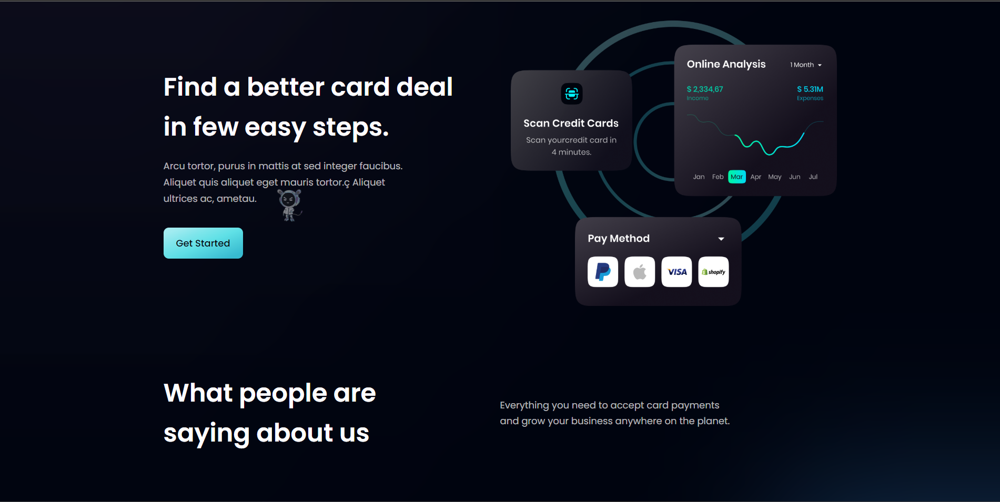

<div align="center">
  

  <div>
  <h3>Home Page</h3>
    
  <h3>Features</h3>
      
  <h3>Product</h3>
      
  <h3>Clients</h3>
      
  </div>


  <div>
    
    
  </div>

  <h3 align="center">HooBank</h3>

   
</div>

## 📋 <a name="table">Table of Contents</a>

1. 🤖 [Introduction](#introduction)
2. ⚙️ [Tech Stack](#tech-stack)
3. 🔋 [Features](#features)
4. 🤸 [Quick Start](#quick-start)


## <a name="introduction">🤖 Introduction</a>

HooBank is a static web application built using [React.js](https://react.dev/) and [TailwindCSS](https://tailwindcss.com/). It's a modern based UI for user. 


## <a name="tech-stack">⚙️ Tech Stack</a>

- React.Js
- TailwindCSS


## <a name="features">🔋 Features</a>

### Features of HooBank


**Easily navigation through navbar to your desire section**

**Responsive web application, easy to open in phone broweser too.**

**Reusable Components:- You can use many times as your desire**


## <a name="quick-start">🤸 Quick Start</a>

Follow these steps to set up the project locally on your machine.

**Prerequisites**

Make sure you have the following installed on your machine:

- [Git](https://git-scm.com/)
- [Node.js](https://nodejs.org/en)
- [npm](https://www.npmjs.com/) (Node Package Manager)

**Cloning the Repository**

```bash
git clone https://github.com/Sahil-2703/hoobank.git
cd hoobank
```

**Installation**

Install the project dependencies using npm:

```bash
npm install
```

**Running the Project**

```bash
npm start
```

Open [http://localhost:3000](http://localhost:3000) in your browser to view the project.

You can visit here to see before cloning [HooBank](https://hoobank-lilac-theta.vercel.app/).

